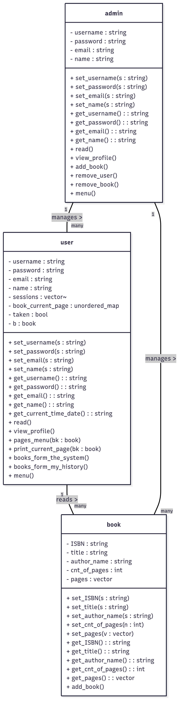

# 📚 Online Book Reader

A simple **command-line Book Reader system** written in **C++**.  
Supports **user** and **admin** accounts, **book management**, and **reading tracking**.

---

## 🔹 User Features

- **Sign Up / Login**  
  Create a new account or log in with existing credentials.

- **View Profile**  
  Display personal details: name, email, and username.

- **Browse Available Books**  
  List all books in the system, view details, and choose a book to read.

- **Read Books**  
  - Read books page-by-page.  
  - Navigate pages (next / previous).  
  - Resume reading from where you left off.

- **Reading History**  
  - View a list of previously read books and last read time.  
  - Resume from any book in the history.

---

## 🔹 Admin Features

- **Admin Login**  
  Dedicated admin accounts for management tasks.

- **View Admin Profile**  
  Display name, email, username, and password.

- **Add Books**  
  Enter details: ISBN, title, author, and pages.

- **Remove Books**  
  Delete a book by its title.

- **Remove Users**  
  Delete a user account by username.

---

## 🔹 System Features

- **Input Validation**  
  Safe input routines to prevent crashes and invalid entries.

- **Unique Usernames**  
  Usernames are guaranteed to be unique for both users and admins.

- **Session Tracking**  
  User reading position is saved per book, per user.

- **Admin/User Separation**  
  Different menus and capabilities for users and admins.
---
## 📷 Screenshot

